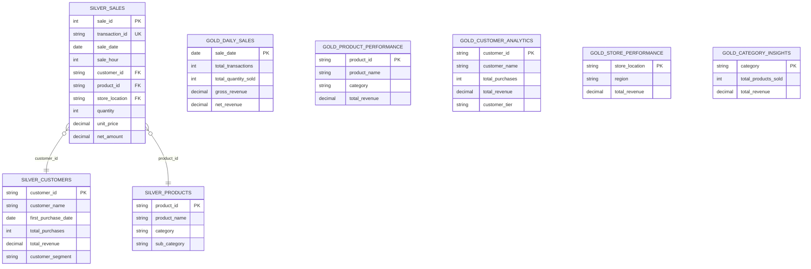
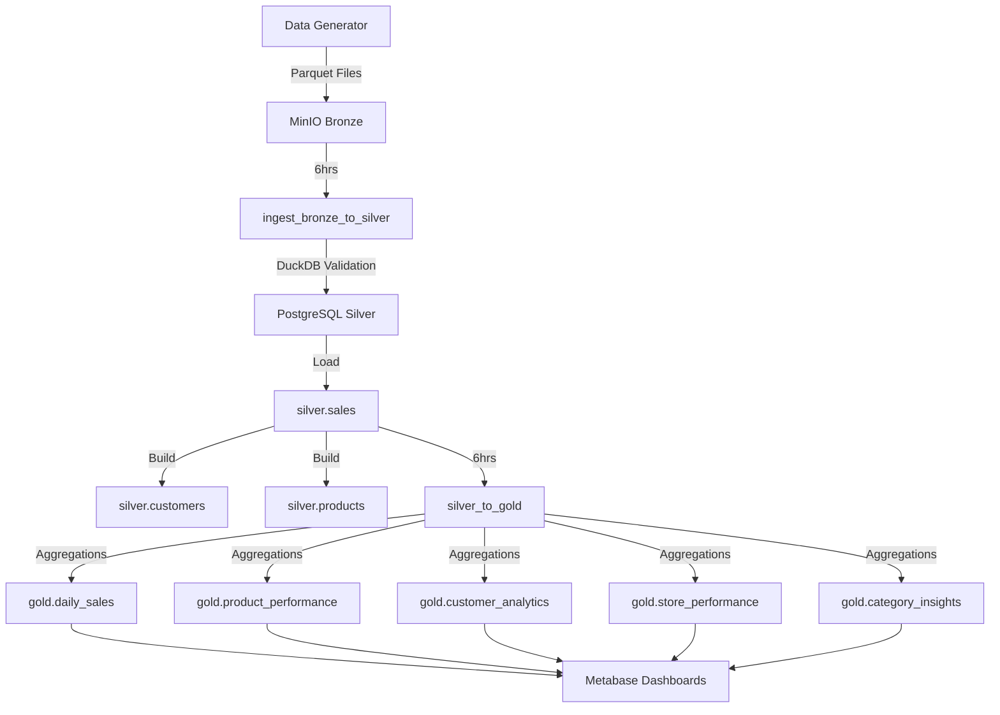

# Mini Data Platform

[](https://github.com/${{ github.repository }}/actions/workflows/ci-cd.yml)
[](https://www.python.org/)
[](https://www.docker.com/)

> A production-grade containerized data platform using Docker Compose that implements medallion architecture (Bronze → Silver → Gold) with Star Schema and CI/CD automation.

## Architecture

See [docs/architecture.md](docs/architecture/architecture.md) for detailed diagrams.

```
Data Generator → MinIO (Bronze) → Airflow + DuckDB → PostgreSQL (Silver/Gold) → Metabase
```

## Star Schema Design

This platform implements a proper **Star Schema** for data warehousing.



### All Tables

#### Silver Layer (Schema: `silver`)

| Table | Type | Description |
|-------|------|-------------|
| `sales` | Fact | Transaction records |
| `customers` | Dimension | Customer profiles |
| `products` | Dimension | Product catalog |

#### Gold Layer (Schema: `gold`)

| Table | Type | Primary Key | Description |
|-------|------|-------------|-------------|
| `daily_sales` | Fact | `sale_date` | Daily aggregated metrics |
| `product_performance` | Fact | `product_id` | Product analytics |
| `customer_analytics` | Fact | `customer_id` | Customer behavior |
| `store_performance` | Fact | `store_location` | Store metrics |
| `category_insights` | Fact | `category` | Category aggregates |
| `v_monthly_sales` | View | — | Monthly aggregated view |
| `v_regional_sales` | View | — | Regional sales view |

### Customer Segmentation

| Tier | Revenue Threshold |
|------|------------------|
| Bronze | < $1,000 |
| Silver | $1,000 - $5,000 |
| Gold | $5,000 - $10,000 |
| Platinum | > $10,000 |

## Tech Stack

| Component       | Technology       | Port      | Purpose                          |
|-----------------|------------------|-----------|----------------------------------|
| Data Lake       | MinIO            | 9002/9003 | Bronze layer (Parquet files)     |
| Query Engine    | DuckDB           | —         | Schema-on-read validation        |
| Database        | PostgreSQL 16    | 5433      | Silver/Gold layers + Metadata    |
| Orchestration   | Apache Airflow   | 8080      | ETL pipeline scheduling          |
| Visualization   | Metabase         | 3000      | BI dashboards & reporting        |
| CI/CD           | GitHub Actions   | —         | Automated pipelines              |

## Prerequisites

- [Docker](https://docs.docker.com/get-docker/) & Docker Compose v2+
- [Git](https://git-scm.com/)
- 8GB+ RAM recommended

## Quick Start

```bash
# 1. Clone the repository
git clone <repo-url>
cd Amalitech_CI-CD-and-Workflow-Automation_Mini-Data-Mart

# 2. Start all services
docker compose up -d --build

# 3. Wait for services to initialize (~2 minutes)
docker compose ps

# 4. Access the services (see table below)
```

## Services & Credentials

| Service         | URL                          | Credentials             |
|-----------------|------------------------------|------------------------|
| Airflow UI      | http://localhost:8080        | admin / airflow        |
| Metabase        | http://localhost:3000        | Set up on first visit  |
| MinIO Console   | http://localhost:9003        | minio / minio123       |
| PostgreSQL      | localhost:5433               | airflow / airflow      |

## Project Structure

```
.
├── .github/workflows/       # CI/CD pipeline definitions
├── dags/                   # Airflow DAG definitions
│   ├── etl/
│   │   ├── ingest_bronze_to_silver.py   # Bronze → Silver
│   │   ├── silver_to_gold.py             # Silver → Gold (Star Schema)
│   │   └── generate_sample_data.py      # Auto data generation
│   └── utils/
│       ├── minio_hook.py                # MinIO operations
│       ├── postgres_hook.py             # PostgreSQL operations
│       └── duckdb_utils.py              # DuckDB validation
├── data/                   # Data storage (local)
├── docs/                   # Documentation
│   └── architecture.md     # Architecture diagrams
├── scripts/                # Utility scripts
│   ├── data_generator/    # Parquet data generator
│   ├── postgres_init/    # Database initialization
│   └── init-minio.sh     # MinIO bucket setup
├── docker-compose.yml      # All services definition
├── Dockerfile             # Airflow custom image
├── requirements.txt        # Python dependencies
├── .env                   # Environment variables
└── README.md
```

## Data Flow & Pipelines



### DAGs & Scheduling

| DAG | Schedule | Description |
|-----|----------|-------------|
| `generate_sample_data` | 6am, 12pm, 6pm | Generates 1000 rows to MinIO |
| `ingest_bronze_to_silver` | Every 6 hours | Loads Bronze → Silver with validation |
| `silver_to_gold` | Every 6 hours | Builds Star Schema (dimensions + facts) |

## Database Schema

### Silver Layer

**Fact Table: `silver.sales`**
| Column | Type | Description |
|--------|------|-------------|
| sale_id | SERIAL | Primary key |
| transaction_id | VARCHAR(50) | Unique transaction ID |
| sale_date | DATE | Date of sale |
| customer_id | VARCHAR(50) | FK to customers |
| product_id | VARCHAR(50) | FK to products |
| quantity | INTEGER | Units sold |
| net_amount | DECIMAL | Revenue after discount |
| ... | ... | Other sales fields |

**Dimension Table: `silver.customers`**
| Column | Type | Description |
|--------|------|-------------|
| customer_id | VARCHAR(50) | Primary key |
| customer_name | VARCHAR(100) | Full name |
| first_purchase_date | DATE | First transaction |
| total_purchases | INTEGER | Transaction count |
| total_revenue | DECIMAL | Lifetime value |
| customer_segment | VARCHAR(20) | Bronze/Silver/Gold/Platinum |

**Dimension Table: `silver.products`**
| Column | Type | Description |
|--------|------|-------------|
| product_id | VARCHAR(50) | Primary key |
| product_name | VARCHAR(100) | Product name |
| category | VARCHAR(50) | Product category |
| min/max/avg_unit_price | DECIMAL | Price statistics |
| total_quantity_sold | INTEGER | Units sold |
| total_revenue | DECIMAL | Total revenue |

### Gold Layer

| Table | Primary Key | Description |
|-------|-------------|-------------|
| daily_sales | sale_date | Daily aggregated metrics |
| product_performance | product_id | Product-level analytics |
| customer_analytics | customer_id | Customer behavior analysis |
| store_performance | store_location | Store-level metrics |
| category_insights | category | Category aggregates |

## Running the Pipeline

```bash
# Generate and upload data to MinIO (or wait for scheduled run)
docker compose exec airflow-worker python scripts/data_generator/generator.py

# Trigger DAGs via Airflow UI at http://localhost:8080
# Or via CLI:
docker compose exec airflow-worker airflow dags trigger ingest_bronze_to_silver
docker compose exec airflow-worker airflow dags trigger silver_to_gold

# Verify data
docker compose exec postgres psql -U airflow -d airflow -c "SELECT COUNT(*) FROM silver.sales"
```

## CI/CD Pipeline

The project includes GitHub Actions workflows for:
- Building Docker images on every commit
- Running unit and schema tests
- Deploying to test environment
- Validating data flow through all components

## Contributing

1. Fork the repository
2. Create a feature branch: `git checkout -b feature/my-feature`
3. Commit changes: `git commit -m "feat: add my feature"`
4. Push to the branch: `git push origin feature/my-feature`
5. Open a Pull Request

## License

This project is for educational purposes as part of the Amalitech DEM012 CI/CD module.
