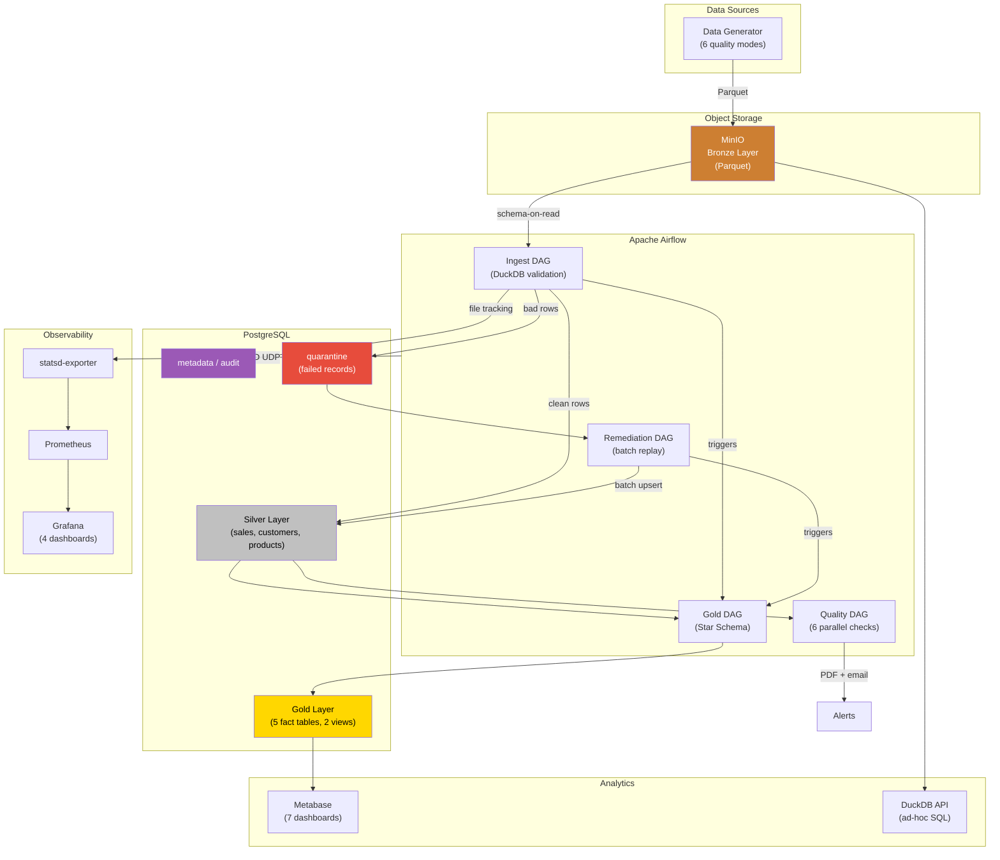
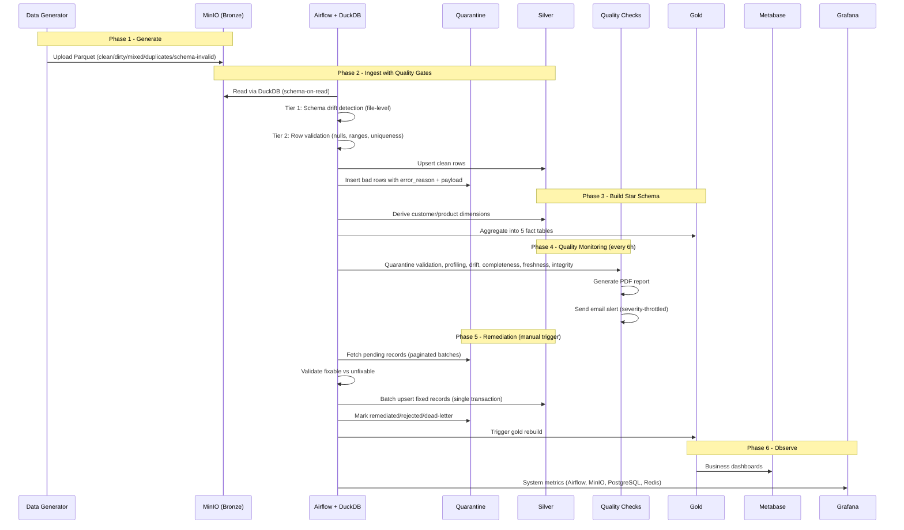
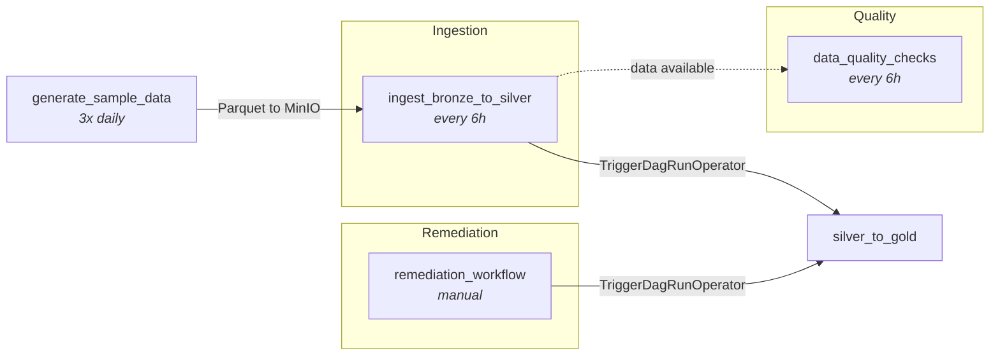
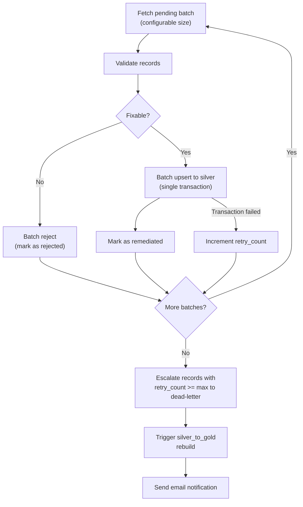
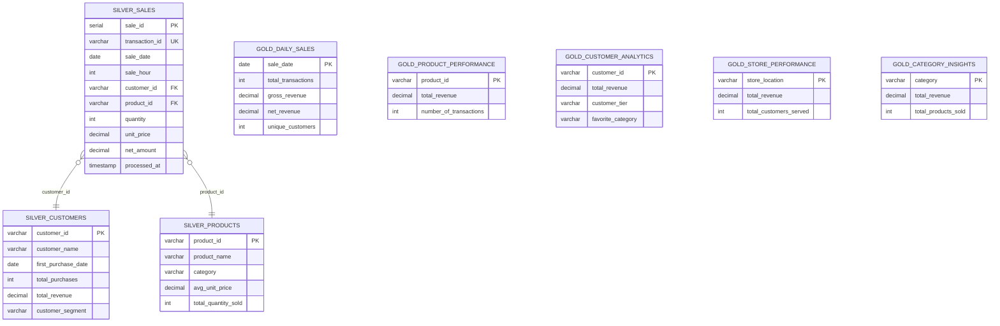
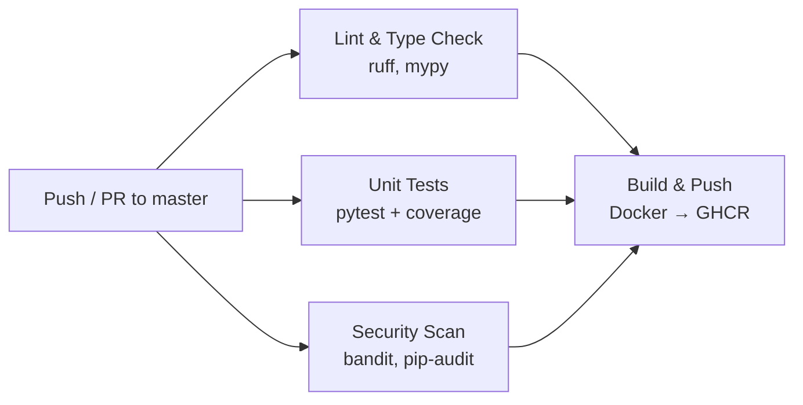

# Mini Data Platform

[](https://www.python.org/)
[](https://airflow.apache.org/)
[](https://www.docker.com/)
[](https://www.postgresql.org/)
[](./LICENSE)

A production-grade containerized data platform implementing the **Medallion Architecture** (Bronze, Silver, Gold) with automated data quality monitoring, self-healing remediation, and full observability.

---

## Table of Contents

- [Architecture](#architecture)
- [Tech Stack](#tech-stack)
- [Prerequisites](#prerequisites)
- [Quick Start](#quick-start)
- [Services and Access](#services-and-access)
- [Project Structure](#project-structure)
- [Data Pipeline](#data-pipeline)
- [Data Quality Framework](#data-quality-framework)
- [Remediation Workflow](#remediation-workflow)
- [Monitoring and Observability](#monitoring-and-observability)
- [Database Schema](#database-schema)
- [CI/CD Pipeline](#cicd-pipeline)
- [Metabase Dashboards](#metabase-dashboards)
- [Testing](#testing)
- [Configuration Reference](#configuration-reference)
- [Contributing](#contributing)
- [License](#license)

---

## Architecture

### System Overview



### Data Flow Sequence



---

## Tech Stack

| Component | Technology | Port | Purpose |
|-----------|-----------|------|---------|
| Object Storage | MinIO | 9002 / 9003 | Bronze layer (Parquet files) |
| Query Engine | DuckDB | -- | Schema-on-read validation (no data download) |
| Database | PostgreSQL 16 | 5433 | Silver / Gold / Metadata / Quarantine |
| Orchestration | Apache Airflow 3.x | 8080 | DAG scheduling and execution |
| Task Queue | Redis 7 | 6379 | Celery broker for Airflow workers |
| BI Dashboards | Metabase | 3000 | Business analytics |
| Ad-hoc Query | DuckDB API (FastAPI) | 8000 | SQL-on-S3 web interface |
| Metrics | Prometheus | 9090 | Time-series metric storage |
| Visualization | Grafana | 3001 | System monitoring dashboards |
| StatsD Bridge | statsd-exporter | 9102 / 9125 | Airflow StatsD to Prometheus |
| DB Metrics | postgres-exporter | 9187 | PostgreSQL metrics for Prometheus |
| Cache Metrics | redis-exporter | 9121 | Redis metrics for Prometheus |
| CI/CD | GitHub Actions | -- | Lint, test, build, deploy |

---

## Prerequisites

- [Docker](https://docs.docker.com/get-docker/) and Docker Compose v2+
- [Git](https://git-scm.com/)
- 8 GB+ RAM recommended

---

## Quick Start

```bash
# Clone
git clone <repo-url>
cd Amalitech_CI-CD-and-Workflow-Automation_Mini-Data-Mart

# Start all services
docker compose up -d --build

# Wait for initialization (~2 minutes)
docker compose ps

# Verify data pipeline
docker compose exec postgres psql -U airflow -d airflow \
  -c "SELECT COUNT(*) FROM silver.sales"
```

---

## Services and Access

| Service | URL | Credentials |
|---------|-----|-------------|
| Airflow UI | http://localhost:8080 | admin / airflow |
| Metabase | http://localhost:3000 | Set up on first visit |
| Grafana | http://localhost:3001 | admin / admin (or anonymous) |
| MinIO Console | http://localhost:9003 | minio / minio123 |
| DuckDB API | http://localhost:8000 | -- |
| Prometheus | http://localhost:9090 | -- |
| PostgreSQL | localhost:5433 | airflow / airflow |

---

## Project Structure

```
.
├── .github/workflows/          # CI/CD pipeline definitions
├── config/                     # Monitoring stack configuration
│   ├── grafana/
│   │   ├── dashboards/         # Pre-built Grafana dashboard JSON
│   │   │   ├── airflow-metrics.json
│   │   │   ├── minio-metrics.json
│   │   │   ├── postgres-metrics.json
│   │   │   └── redis-metrics.json
│   │   └── provisioning/       # Auto-provisioning configs
│   │       ├── dashboards/
│   │       └── datasources/
│   ├── prometheus/
│   │   └── prometheus.yml      # Scrape targets
│   └── statsd-exporter/
│       └── mappings.yml        # Airflow metric name mappings
├── dags/                       # Airflow DAG definitions
│   ├── etl/
│   │   ├── generate_sample_data.py
│   │   ├── ingest_bronze_to_silver.py
│   │   ├── silver_to_gold.py
│   │   ├── data_quality.py
│   │   └── remediation.py
│   └── utils/
│       ├── postgres_hook.py
│       ├── minio_hook.py
│       ├── duckdb_utils.py
│       └── email_utils.py
├── scripts/
│   ├── data_generator/         # Synthetic data generator
│   ├── postgres_init/          # Database DDL (init.sql)
│   └── init-minio.sh           # MinIO bucket creation
├── services/
│   └── duckdb-api/             # FastAPI ad-hoc query service
├── tests/                      # Unit, integration, E2E tests
├── docs/                       # Architecture docs, SQL queries
├── docker-compose.yml
├── Dockerfile
├── requirements.txt
└── .env
```

---

## Data Pipeline

### DAG Overview

| DAG | Schedule | Trigger | Description |
|-----|----------|---------|-------------|
| `generate_sample_data` | `0 6,12,18 * * *` | Scheduled | Generates 1000 rows per mode to MinIO |
| `ingest_bronze_to_silver` | `0 */6 * * *` | Scheduled | Two-tier validation, split good/bad rows |
| `silver_to_gold` | None | Triggered by ingestion / remediation | Builds star schema (dimensions then facts) |
| `data_quality_checks` | `0 */6 * * *` | Scheduled | 6 parallel quality checks, PDF report |
| `remediation_workflow` | None | Manual | Batch fix and replay quarantined records |

### DAG Dependency Graph



### Medallion Architecture

```
Bronze (MinIO)                    Silver (PostgreSQL)              Gold (PostgreSQL)
─────────────────                 ─────────────────────            ──────────────────
s3://bronze/sales/                silver.sales (fact)              gold.daily_sales
  ingest_date=YYYY-MM-DD/        silver.customers (dim)           gold.product_performance
    <uuid>.parquet                silver.products (dim)            gold.customer_analytics
                                                                   gold.store_performance
                                                                   gold.category_insights
                                                                   gold.v_monthly_sales (view)
                                                                   gold.v_regional_sales (view)
```

### Two-Tier Validation

**Tier 1 -- File-Level (Schema Drift Detection)**

Compares actual Parquet columns against expected spec. If there is a mismatch (missing columns, extra columns, type changes), the entire file is rejected with status `SCHEMA_DRIFT` in `metadata.ingestion_metadata`. The file is never re-read on subsequent runs.

**Tier 2 -- Row-Level Validation**

For schema-valid files, each row is checked for:
- Required columns: `transaction_id`, `sale_date`, `customer_id`, `product_id`, `quantity`, `unit_price`, `net_amount`
- Value ranges: quantity [1, 1000], unit_price [0, 100000], discount_percentage [0, 100]
- Rows failing validation are tagged with `error_reason` (e.g., `null:customer_id;range:quantity`) and sent to quarantine with the full payload preserved as JSONB.

---

## Data Quality Framework

Six checks run in parallel every 6 hours:

| Check | What It Validates | Threshold |
|-------|-------------------|-----------|
| Quarantine Patterns | No NULL ids/payloads/errors in quarantine table | 0 nulls |
| Silver Profiling | Row counts across `sales`, `customers`, `products` | Tables populated |
| Drift Detection | Current row count vs 24-hour baseline | < 10% change |
| Completeness | Non-null percentage for critical columns | >= 95% |
| Freshness | Time since last `processed_at` in `silver.sales` | <= 24 hours |
| Referential Integrity | Orphan `customer_id` / `product_id` in sales | 0 orphans |

**Outputs:**
- PDF report generated via ReportLab with all check results
- Email alert with PDF attachment (severity-throttled: CRITICAL immediate, WARNING 1h, INFO 6h)

---

## Remediation Workflow

The `remediation_workflow` DAG processes quarantined records with production-grade patterns:



**Key design decisions:**

| Concern | Implementation |
|---------|---------------|
| Batch operations | All valid records upserted in one `executemany` call, not row-by-row |
| Transactional consistency | Silver insert + quarantine update in a single `COMMIT`; `ROLLBACK` on failure |
| Status tracking | `remediation_status` enum: `pending` / `remediated` / `rejected` / `dead_letter` |
| Dead-letter escalation | After `retry_count >= max_retries` (default 3), records move to `dead_letter` |
| Pagination | Processes batches until no pending records remain |
| Configurable | `remediation_batch_size` and `remediation_max_retries` via Airflow Variables |
| Gold rebuild | `TriggerDagRunOperator` fires `silver_to_gold` after remediation completes |

---

## Monitoring and Observability

### Metrics Pipeline

```
Airflow (scheduler/worker/api-server/triggerer/dag-processor)
    │  StatsD UDP :9125
    v
statsd-exporter (:9102)  ──┐
MinIO (/minio/v2/metrics)  ├──> Prometheus (:9090) ──> Grafana (:3001)
postgres-exporter (:9187)  │
redis-exporter (:9121)   ──┘
```

All five Airflow services emit StatsD metrics. Prometheus scrapes four exporters every 15 seconds. Grafana auto-provisions four dashboards on startup.

### Grafana Dashboards

| Dashboard | Key Panels |
|-----------|-----------|
| **Airflow Metrics** | Scheduler heartbeat rate, loop duration, DAG run duration, task finish rate, executor slots, pool usage |
| **MinIO Metrics** | Bucket size, object count, S3 traffic rate, request rate by API, error rate, cluster disk capacity |
| **PostgreSQL Metrics** | Active connections, connection utilization, database size, tuple operations rate, transaction commits/rollbacks, cache hit ratio |
| **Redis Metrics** | Memory usage, connected/blocked clients, commands processed rate, connection rate, keys per database, keyspace hit ratio |

### Verification

```bash
# Check Prometheus targets are up
curl -s http://localhost:9090/api/v1/targets | python3 -m json.tool

# Query a metric
curl -s 'http://localhost:9090/api/v1/query?query=airflow_scheduler_heartbeat'

# Open Grafana (anonymous access enabled)
open http://localhost:3001
```

---

## Database Schema

### Star Schema (ER Diagram)



### Schema Overview

| Schema | Table | Purpose |
|--------|-------|---------|
| `silver` | `sales` | Cleaned transaction fact table |
| `silver` | `customers` | Customer dimension (derived from sales) |
| `silver` | `products` | Product dimension (derived from sales) |
| `gold` | `daily_sales` | Daily aggregated metrics |
| `gold` | `product_performance` | Product-level KPIs |
| `gold` | `customer_analytics` | Customer segments and behavior |
| `gold` | `store_performance` | Store-level metrics |
| `gold` | `category_insights` | Category aggregates |
| `gold` | `v_monthly_sales` | Monthly trends (view) |
| `gold` | `v_regional_sales` | Regional performance (view) |
| `quarantine` | `sales_failed` | Failed records with payload, error, retry tracking |
| `metadata` | `ingestion_metadata` | File processing status (PROCESSED / SCHEMA_DRIFT / FAILED) |
| `metadata` | `quality_baselines` | Historical metrics for drift detection |
| `audit` | `ingestion_runs` | Per-run audit trail (rows read/written/quarantined) |

### Column Reference

**silver.sales**: sale_id (PK), transaction_id (UK), sale_date, sale_hour, customer_id, customer_name, product_id, product_name, category, sub_category, quantity, unit_price, discount_percentage, discount_amount, gross_amount, net_amount, profit_margin, payment_method, payment_category, store_location, region, is_weekend, is_holiday, ingest_date, source_file, processed_at

**silver.customers**: customer_id (PK), customer_name, first_purchase_date, total_purchases, total_revenue, average_order_value, customer_segment, last_purchase_date, days_since_last_purchase

**silver.products**: product_id (PK), product_name, category, sub_category, min_unit_price, max_unit_price, avg_unit_price, total_quantity_sold, total_revenue

**quarantine.sales_failed**: id + ingestion_run_id (composite PK), payload (JSONB), error_reason, failed_at, source_file, corrected_by, corrected_at, replayed, replayed_at, remediation_status, retry_count

**gold.daily_sales**: sale_date (PK), total_transactions, total_quantity_sold, gross_revenue, total_discounts, net_revenue, average_order_value, unique_customers, unique_products, top_category

**gold.product_performance**: product_id (PK), product_name, category, total_quantity_sold, total_revenue, average_unit_price, total_discount_given, number_of_transactions

**gold.customer_analytics**: customer_id (PK), customer_name, total_purchases, total_revenue, average_order_value, favorite_category, favorite_payment_method, most_visited_store, customer_tier

**gold.store_performance**: store_location (PK), region, total_transactions, total_revenue, average_order_value, total_customers_served, top_selling_category

**gold.category_insights**: category (PK), total_products_sold, total_revenue, average_discount_percentage, number_of_transactions, average_order_value

**metadata.ingestion_metadata**: file_path (PK), dataset_name, checksum, ingest_date, status, record_count, processed_at, airflow_run_id, error_message

### Quarantine Record Lifecycle

```
                       ┌──────────────────────────────────┐
                       │          pending                  │
                       │  (initial state on insert)        │
                       └──────┬──────────────┬─────────────┘
                              │              │
                   validation passes    validation fails
                              │              │
                              v              v
                     ┌────────────┐   ┌─────────────┐
                     │ remediated │   │  rejected    │
                     │ (in silver)│   │ (unfixable)  │
                     └────────────┘   └─────────────┘
                              │
                    batch replay fails
                    retry_count incremented
                              │
                    retry_count >= max_retries
                              │
                              v
                     ┌────────────────┐
                     │  dead_letter    │
                     │ (needs manual   │
                     │  investigation) │
                     └────────────────┘
```

---

## CI/CD Pipeline



| Job | Tools | Description |
|-----|-------|-------------|
| Lint & Type Check | ruff check, ruff format, mypy | Linting, formatting, type checking |
| Unit Tests | pytest, pytest-cov | DAG imports, generator, task logic |
| Security Scan | bandit, pip-audit | Code vulnerability + dependency audit |
| Build & Push | Docker Buildx | Build image, push to GHCR (master only) |

Workflow features: `workflow_dispatch` for manual triggers, concurrency groups to cancel stale runs, pip caching, JUnit XML test output.

---

## Metabase Dashboards

Seven pre-configured dashboards connect to the Gold layer:

| Dashboard | Key Metrics |
|-----------|-----------|
| Main Dashboard | Unified KPIs across all domains |
| Executive Summary | Revenue, transactions, customer count |
| Sales Overview | Daily trends, payment methods, weekend vs weekday |
| Product Analytics | Product revenue, category performance |
| Customer Analytics | Segments, lifetime value, tier distribution |
| Store Performance | Revenue by location, top stores |
| Data Quality | Quarantine trends, error types, quality score |

**Setup:** Open http://localhost:3000, connect to PostgreSQL (`host: postgres`, `port: 5432`, `db: airflow`, `user: airflow`, `pass: airflow`). See `docs/dashboard_queries.sql` for all 40+ queries.

---

## Testing

```bash
# Run all tests
docker compose exec airflow-worker pytest tests/ -v

# Run specific suite
docker compose exec airflow-worker pytest tests/test_remediation.py -v

# Verify data counts
docker compose exec postgres psql -U airflow -d airflow -c "
  SELECT 'silver.sales' AS tbl, COUNT(*) FROM silver.sales
  UNION ALL SELECT 'silver.customers', COUNT(*) FROM silver.customers
  UNION ALL SELECT 'silver.products', COUNT(*) FROM silver.products
  UNION ALL SELECT 'quarantine.sales_failed', COUNT(*) FROM quarantine.sales_failed
  UNION ALL SELECT 'gold.daily_sales', COUNT(*) FROM gold.daily_sales;
"
```

---

## Configuration Reference

### Environment Variables (`.env`)

| Variable | Default | Description |
|----------|---------|-------------|
| `POSTGRES_USER` | `airflow` | PostgreSQL username |
| `POSTGRES_PASSWORD` | `airflow` | PostgreSQL password |
| `MINIO_ROOT_USER` | `minio` | MinIO access key |
| `MINIO_ROOT_PASSWORD` | `minio123` | MinIO secret key |
| `GRAFANA_PORT` | `3001` | Grafana host port |
| `AIRFLOW_UID` | `50000` | Airflow container user ID |

### Airflow Variables

| Variable | Default | Description |
|----------|---------|-------------|
| `alert_email` | `daniel.doe@a2sv.org` | Alert recipient |
| `remediation_batch_size` | `1000` | Records per remediation batch |
| `remediation_max_retries` | `3` | Max retries before dead-letter |

### Monitoring Ports

| Port | Protocol | Service |
|------|----------|---------|
| 9125 | UDP | StatsD ingest (Airflow -> statsd-exporter) |
| 9102 | HTTP | statsd-exporter metrics (Prometheus scrape) |
| 9090 | HTTP | Prometheus UI and API |
| 9187 | HTTP | postgres-exporter metrics |
| 9121 | HTTP | redis-exporter metrics |
| 3001 | HTTP | Grafana UI |

---

## Contributing

1. Fork the repository
2. Create a feature branch: `git checkout -b feature/my-feature`
3. Commit changes: `git commit -m "feat: add my feature"`
4. Push to the branch: `git push origin feature/my-feature`
5. Open a Pull Request

---

## License

This project is for educational purposes as part of the Amalitech DEM012 CI/CD and Workflow Automation module.
