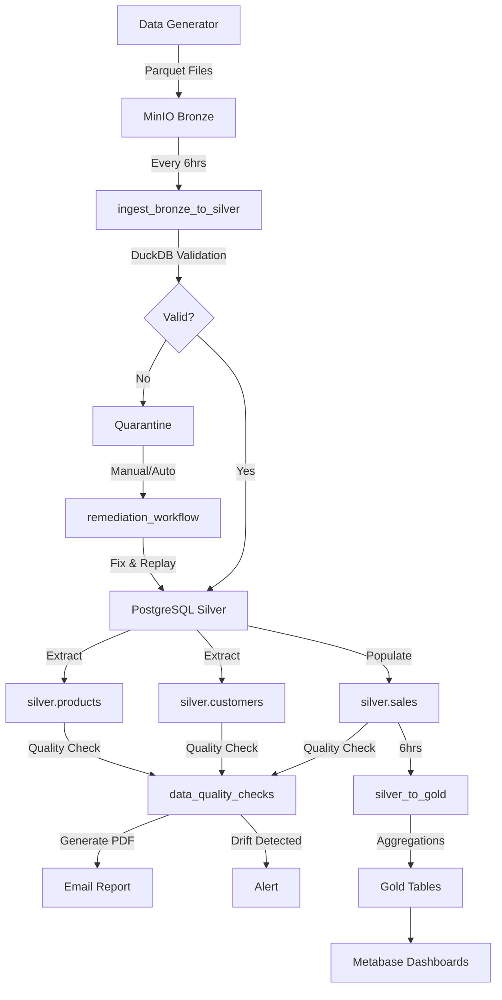
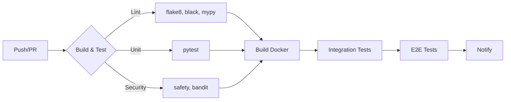

# Mini Data Platform

[](https://github.com/${{ github.repository }}/actions/workflows/ci-cd.yml)
[](https://www.python.org/)
[](https://www.docker.com/)

> A production-grade containerized data platform using Docker Compose that implements medallion architecture (Bronze → Silver → Gold) with Star Schema, CI/CD automation, and data quality monitoring.

## Architecture Overview

```
Data Generator → MinIO (Bronze) → Airflow + DuckDB → PostgreSQL (Silver/Gold) → Metabase
                                            ↓
                              Data Quality (SQL-based) + PDF Reports
                                            ↓
                              Remediation Workflow (Auto-fix)
```

## New Features (Latest Updates)

- ✅ **Silver Layer Population**: Customers & Products now populated during `ingest_bronze_to_silver`
- ✅ **Comprehensive Data Quality**: Validates all 3 Silver tables (sales, customers, products)
- ✅ **SQL-Based Quality Checks**: No external dependencies - pure SQL queries for validation
- ✅ **PDF Reports**: Data quality reports generated as PDF and attached to emails
- ✅ **Remediation Workflow**: Automatic fixing and replaying of quarantined records
- ✅ **CI/CD Pipeline**: GitHub Actions with unit, integration, and E2E tests

## Star Schema Design

This platform implements a proper **Star Schema** for data warehousing.


### All Tables

#### Silver Layer (Schema: `silver`)

| Table | Type | Description |
|-------|------|-------------|
| `sales` | Fact | Transaction records (populated from Bronze) |
| `customers` | Dimension | Customer profiles (populated from Bronze during ingest) |
| `products` | Dimension | Product catalog (populated from Bronze during ingest) |

#### Gold Layer (Schema: `gold`)

| Table | Type | Primary Key | Description |
|-------|------|-------------|-------------|
| `daily_sales` | Fact | `sale_date` | Daily aggregated metrics |
| `product_performance` | Fact | `product_id` | Product analytics |
| `customer_analytics` | Fact | `customer_id` | Customer behavior |
| `store_performance` | Fact | `store_location` | Store metrics |
| `category_insights` | Fact | `category` | Category aggregates |
| `v_monthly_sales` | View | — | Monthly aggregated view |
| `v_regional_sales` | View | — | Regional sales view |

### Quarantine Schema

| Table | Type | Description |
|-------|------|-------------|
| `sales_failed` | Quarantine | Failed records pending remediation |

## Tech Stack

| Component       | Technology       | Port      | Purpose                          |
|-----------------|------------------|-----------|----------------------------------|
| Data Lake       | MinIO            | 9002/9003 | Bronze layer (Parquet files)     |
| Query Engine    | DuckDB           | —         | Schema-on-read validation        |
| Database        | PostgreSQL 16    | 5433      | Silver/Gold layers + Metadata    |
| Orchestration   | Apache Airflow   | 8080      | ETL pipeline scheduling          |
| Visualization   | Metabase         | 3000      | BI dashboards & reporting        |
| CI/CD           | GitHub Actions   | —         | Automated pipelines              |

## Prerequisites

- [Docker](https://docs.docker.com/get-docker/) & Docker Compose v2+
- [Git](https://git-scm.com/)
- 8GB+ RAM recommended

## Quick Start

```bash
# 1. Clone the repository
git clone <repo-url>
cd Amalitech_CI-CD-and-Workflow-Automation_Mini-Data-Mart

# 2. Start all services
docker compose up -d --build

# 3. Wait for services to initialize (~2 minutes)
docker compose ps

# 4. Access the services (see table below)
```

## Services & Credentials

| Service         | URL                          | Credentials             |
|-----------------|------------------------------|------------------------|
| Airflow UI      | http://localhost:8080        | admin / airflow        |
| Metabase        | http://localhost:3000        | Set up on first visit  |
| MinIO Console   | http://localhost:9003        | minio / minio123       |
| PostgreSQL      | localhost:5433               | airflow / airflow      |

## Project Structure

```
.
├── .github/workflows/       # CI/CD pipeline definitions
├── dags/                    # Airflow DAG definitions
│   ├── etl/
│   │   ├── data_quality.py           # Data quality checks (SQL-based)
│   │   ├── ingest_bronze_to_silver.py # Bronze → Silver + dimension population
│   │   ├── silver_to_gold.py         # Silver → Gold (Star Schema)
│   │   ├── generate_sample_data.py    # Auto data generation
│   │   └── remediation.py             # Auto-fix quarantined records
│   └── utils/
│       ├── minio_hook.py              # MinIO operations
│       ├── postgres_hook.py           # PostgreSQL operations
│       └── duckdb_utils.py           # DuckDB validation
├── data/                     # Data storage (local)
├── docs/                     # Documentation
│   └── architecture.md       # Architecture diagrams
├── scripts/                  # Utility scripts
│   ├── data_generator/       # Parquet data generator
│   ├── postgres_init/       # Database initialization
│   ├── utils/              # Email, hooks utilities
│   └── run_tests.py         # Test runner
├── tests/                   # Unit & Integration tests
├── docker-compose.yml       # All services definition
├── Dockerfile              # Airflow custom image
├── requirements.txt        # Python dependencies
├── pytest.ini              # Pytest configuration
├── .env                   # Environment variables
└── README.md
```

## Data Flow & Pipelines



### DAGs & Scheduling

| DAG | Schedule | Description |
|-----|----------|-------------|
| `generate_sample_data` | 6am, 12pm, 6pm | Generates 1000 rows to MinIO |
| `ingest_bronze_to_silver` | Every 6 hours | Bronze → Silver with validation + dimension population |
| `data_quality_checks` | Daily 6am | SQL-based quality checks on all Silver tables |
| `silver_to_gold` | After quality | Builds Star Schema (dimensions + facts) |
| `remediation_workflow` | Manual | Fix and replay quarantined records |

### Data Quality Features

- **SQL-Based Validation**: No external dependencies
- **Quarantine Pattern Validation**: Checks for NULL values in quarantined records
- **Profiling**: Row counts and uniqueness for all Silver tables
- **Drift Detection**: Monitors data volume changes (>10% triggers alert)
- **PDF Reports**: Generated and attached to email alerts

### Remediation Features

- **Automatic Validation**: Checks required fields and data types
- **Auto-Rejection**: Invalid records marked as reviewed
- **Replay**: Fixed records re-inserted to Silver
- **Statistics**: Full tracking of remediated vs rejected records

## Database Schema

### Silver Layer

**Fact Table: `silver.sales`**
| Column | Type | Description |
|--------|------|-------------|
| sale_id | SERIAL | Primary key |
| transaction_id | VARCHAR(50) | Unique transaction ID |
| sale_date | DATE | Date of sale |
| customer_id | VARCHAR(50) | FK to customers |
| product_id | VARCHAR(50) | FK to products |
| quantity | INTEGER | Units sold |
| net_amount | DECIMAL | Revenue after discount |
| ... | ... | Other sales fields |

**Dimension Table: `silver.customers`**
| Column | Type | Description |
|--------|------|-------------|
| customer_id | VARCHAR(50) | Primary key |
| customer_name | VARCHAR(100) | Full name |
| first_purchase_date | DATE | First transaction |
| total_purchases | INTEGER | Transaction count |
| total_revenue | DECIMAL | Lifetime value |
| customer_segment | VARCHAR(20) | Bronze/Silver/Gold/Platinum |

**Dimension Table: `silver.products`**
| Column | Type | Description |
|--------|------|-------------|
| product_id | VARCHAR(50) | Primary key |
| product_name | VARCHAR(100) | Product name |
| category | VARCHAR(50) | Product category |
| sub_category | VARCHAR(50) | Product sub-category |
| min/max/avg_unit_price | DECIMAL | Price statistics |
| total_quantity_sold | INTEGER | Units sold |
| total_revenue | DECIMAL | Total revenue |

### Quarantine Layer

**Table: `quarantine.sales_failed`**
| Column | Type | Description |
|--------|------|-------------|
| id | SERIAL | Primary key |
| payload | JSONB | Original record data |
| error_reason | VARCHAR(500) | Why it failed validation |
| source_file | VARCHAR(255) | Source file name |
| failed_at | TIMESTAMP | When it failed |
| replayed | BOOLEAN | Has been remediated |
| replayed_at | TIMESTAMP | When it was remediated |
| corrected_by | VARCHAR(50) | Who fixed it |

### Gold Layer

| Table | Primary Key | Description |
|-------|-------------|-------------|
| daily_sales | sale_date | Daily aggregated metrics |
| product_performance | product_id | Product-level analytics |
| customer_analytics | customer_id | Customer behavior analysis |
| store_performance | store_location | Store-level metrics |
| category_insights | category | Category aggregates |

## Running the Pipeline

```bash
# Generate and upload data to MinIO (or wait for scheduled run)
docker compose exec airflow-worker python scripts/data_generator/generator.py

# Trigger DAGs via Airflow UI at http://localhost:8080
# Or via CLI:
docker compose exec airflow-worker airflow dags trigger generate_sample_data
docker compose exec airflow-worker airflow dags trigger ingest_bronze_to_silver
docker compose exec airflow-worker airflow dags trigger data_quality_checks
docker compose exec airflow-worker airflow dags trigger silver_to_gold
docker compose exec airflow-worker airflow dags trigger remediation_workflow

# Verify data
docker compose exec postgres psql -U airflow -d airflow -c "SELECT COUNT(*) FROM silver.sales"
docker compose exec postgres psql -U airflow -d airflow -c "SELECT COUNT(*) FROM silver.customers"
docker compose exec postgres psql -U airflow -d airflow -c "SELECT COUNT(*) FROM silver.products"
```

## Testing

```bash
# Run unit tests (in Docker)
docker exec airflow-worker python /opt/airflow/scripts/run_tests.py

# Run pytest directly
docker exec airflow-worker pytest tests/ -v

# Run specific test file
docker exec airflow-worker pytest tests/test_remediation.py -v
```

### Test Coverage

- **Unit Tests**: Data generator, DAG imports, task logic
- **Integration Tests**: PostgreSQL, MinIO connectivity
- **E2E Tests**: Full pipeline validation

## CI/CD Pipeline

The project includes GitHub Actions workflows for:



### Pipeline Jobs

| Job | Description |
|-----|-------------|
| Lint & Type Check | flake8, black, mypy |
| Unit Tests | pytest with coverage |
| Build Docker | Builds & pushes to GHCR |
| Integration Tests | PostgreSQL, MinIO connectivity |
| E2E Tests | Full stack, DAG imports, data generator |
| Security Scan | safety, bandit |

## Metabase Dashboards

The platform includes pre-configured dashboards for data visualization:

### Available Dashboards

| Dashboard | Description | Source Tables |
|-----------|-------------|---------------|
| Sales Overview | Daily sales metrics, trends | gold.daily_sales |
| Product Performance | Revenue by product, category | gold.product_performance |
| Customer Analytics | Customer segments, lifetime value | gold.customer_analytics |
| Store Performance | Store metrics by location | gold.store_performance |
| Data Quality | Quality metrics, quarantine trends | quarantine.sales_failed |

### Connecting Metabase

1. Open http://localhost:3000
2. Add a new database:
   - **Database type**: PostgreSQL
   - **Host**: postgres
   - **Port**: 5432
   - **Database name**: airflow
   - **Username**: airflow
   - **Password**: airflow

### Sample Queries

```sql
-- Daily sales summary
SELECT sale_date, total_transactions, net_revenue 
FROM gold.daily_sales 
ORDER BY sale_date DESC;

-- Top products by revenue
SELECT product_name, total_revenue 
FROM gold.product_performance 
ORDER BY total_revenue DESC 
LIMIT 10;
```

## Contributing

1. Fork the repository
2. Create a feature branch: `git checkout -b feature/my-feature`
3. Commit changes: `git commit -m "feat: add my feature"`
4. Push to the branch: `git push origin feature/my-feature`
5. Open a Pull Request

## License

This project is for educational purposes as part of the Amalitech DEM012 CI/CD module.
