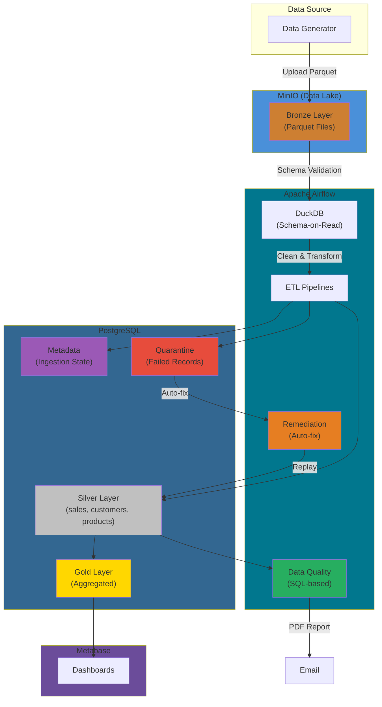
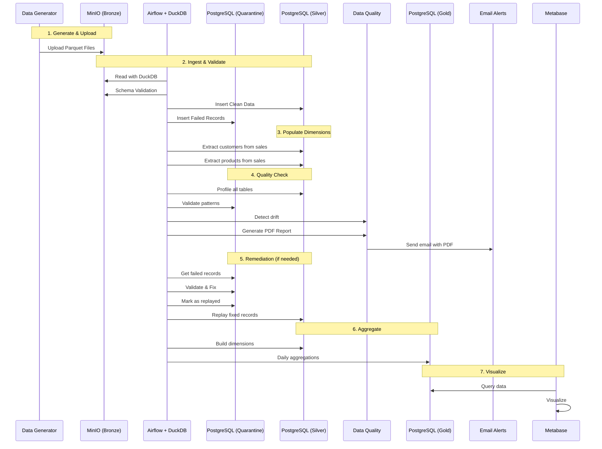
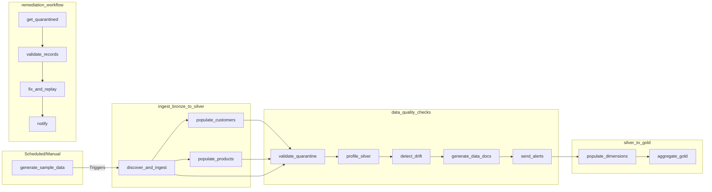
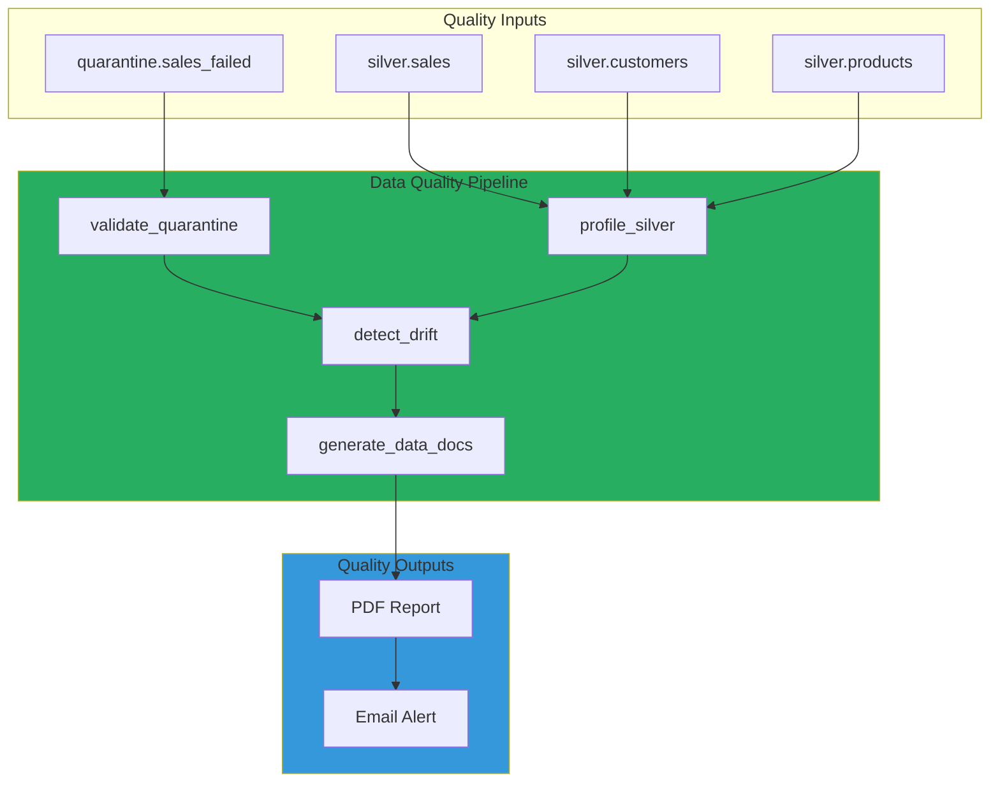
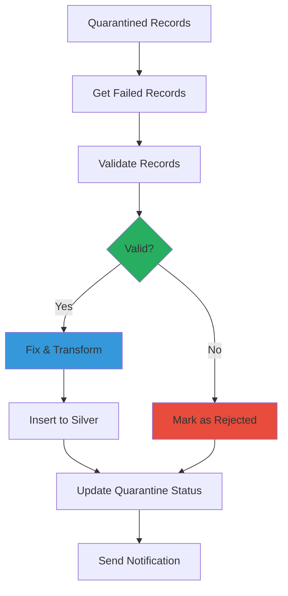
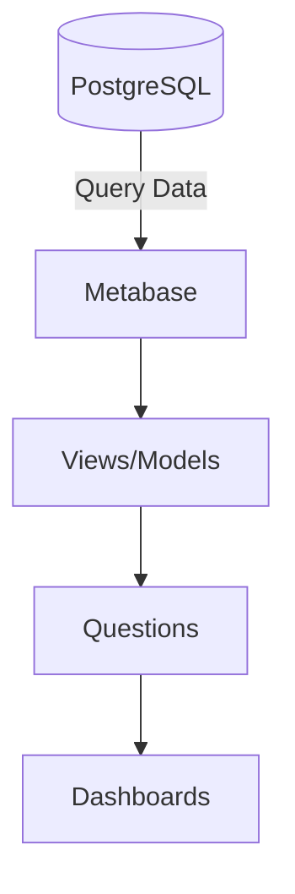

# Mini Data Platform Architecture

## Data Flow Architecture



---

## Updated Data Flow Sequence Diagram



---

## DAG Pipeline Flow



---

## Services Architecture

```mermaid
%%{init: {'theme': 'base'}}}
flowchart LR

    subgraph Services["DOCKER COMPOSE"]
        direction LR
        AF[Airflow<br/>+ DuckDB]
        DB[(PostgreSQL<br/>Silver, Gold, Quarantine, Metadata)]
        Redis[(Redis)]
        MinIO[MinIO<br/>Bronze Layer]
        MB[Metabase]
    end

    AF --> DB
    AF --> Redis
    AF <--> MinIO
    MB --> DB
```

---

## Data Quality Architecture



---

## Remediation Workflow



---

## Testing & Validation

```mermaid
%%{init: {'theme': 'base'}}}
flowchart LR

    subgraph Testing["TESTING & VALIDATION"]
        direction TB
        Unit[Unit Tests<br/>pytest]
        Integration[Integration Tests<br/>Docker]
        E2E[E2E Tests<br/>Full Pipeline]
        Security[Security Scan<br/>safety, bandit]
    end

    subgraph Data["DATA PIPELINE"]
        direction LR
        Bronze
        Silver
        Gold
    end

    Unit -->|Test Code| Data
    Integration -->|Test Connect| Data
    E2E -->|Validate Flow| Data
    Security -->|Scan Code| Dev
```

---

## CI/CD Pipeline

```mermaid
%%{init: {'theme': 'base'}}}
flowchart LR

    subgraph CI["CI - ON PUSH/PR"]
        direction TB
        Lint[Lint & Format<br/>flake8, black, mypy]
        Unit[Unit Tests<br/>pytest]
        Build[Build Docker<br/>GHCR]
    end

    subgraph CD["CD - DEPLOY"]
        direction TB
        Integration[Integration Tests<br/>PostgreSQL, MinIO]
        E2E[E2E Tests<br/>Full Stack]
        Notify[GitHub Summary]
    end

    Push[Push/PR] --> CI
    CI --> Lint
    CI --> Unit
    CI --> Build
    Build --> CD
    CD --> Integration
    CD --> E2E
    E2E --> Notify

    style CI fill:#3498DB
    style CD fill:#27AE60
    style Push fill:#E74C3C
```

---

## Complete System Overview

```mermaid
%%{init: {'theme': 'base'}}}
flowchart TB

    subgraph Dev["DEVELOPMENT"]
        direction TB
        DG[Data Generator]
        Tests[Tests & Validation]
        CI[GitHub Actions]
    end

    subgraph Runtime["RUNTIME ENVIRONMENT"]
        direction LR
        Lake[MinIO Bronze]
        AF[Airflow + DuckDB]
        Quality[Data Quality<br/>SQL-based]
        DB[PostgreSQL<br/>Silver, Gold, Quarantine]
        MB[Metabase]
    end

    DG -->|1. Generate| Lake
    Lake -->|2. Process| AF
    AF -->|3. Validate| Quality
    Quality -->|4. Report| Email
    AF -->|5. Store| DB
    DB -->|6. Visualize| MB
    
    Tests -->|Validate| DG
    CI -->|Deploy| Runtime
```

---

## Schema Summary

### Bronze Layer (MinIO)
- **Bucket**: `bronze`
- **Format**: Parquet files
- **Structure**: Partitioned by `ingest_date`

### Silver Layer (PostgreSQL)
- **Schema**: `silver`
- **Tables**: 
  - `sales` - Transaction fact table
  - `customers` - Customer dimension (populated during ingest)
  - `products` - Product dimension (populated during ingest)

### Quarantine Layer (PostgreSQL)
- **Schema**: `quarantine`
- **Tables**:
  - `sales_failed` - Failed records awaiting remediation

### Gold Layer (PostgreSQL)
- **Schema**: `gold`
- **Tables**: Aggregated analytics (daily_sales, product_performance, etc.)

### Metadata Layer (PostgreSQL)
- **Schema**: `metadata`
- **Tables**:
  - `ingestion_metadata` - Track processed files
  - `audit.ingestion_runs` - Audit trail

---

## Metabase Visualization Layer

### Dashboard Architecture



### Pre-configured Dashboards

| Dashboard | Metrics | Charts |
|-----------|---------|--------|
| Sales Overview | Daily revenue, transactions | Line, Bar |
| Product Performance | Revenue by product, category | Pie, Table |
| Customer Analytics | Segments, LTV | Funnel, Scatter |
| Store Performance | Revenue by location | Map, Bar |
| Data Quality | Failed records, trends | Trend, Gauge |

### Database Connection Setup

1. Navigate to Metabase Admin > Databases
2. Add PostgreSQL database:
   ```
   Host: postgres
   Port: 5432
   Database: airflow
   Username: airflow
   Password: airflow
   ```

### Recommended Visualizations

- **Time Series**: Daily sales trends (line chart)
- **Categorical**: Revenue by product category (pie/bar)
- **Ranking**: Top 10 products/customers (table with ranking)
- **Geographic**: Sales by store location (map)
