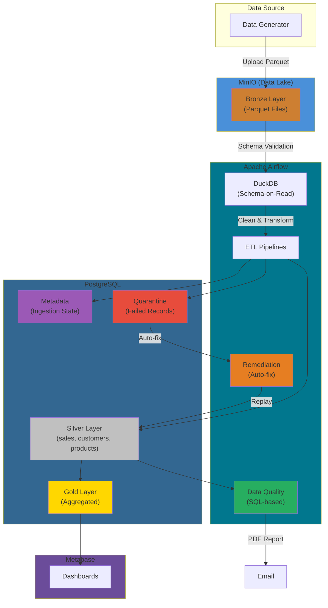
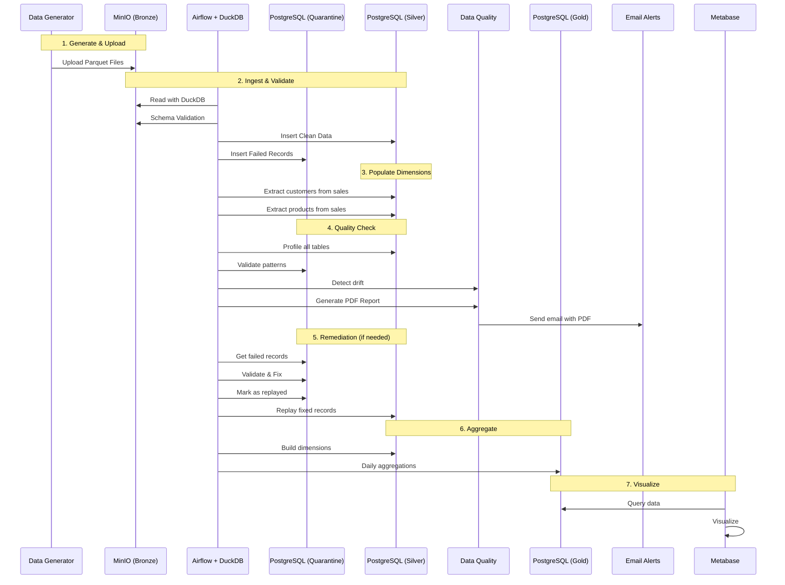
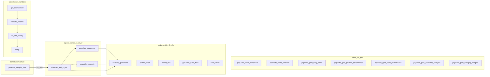
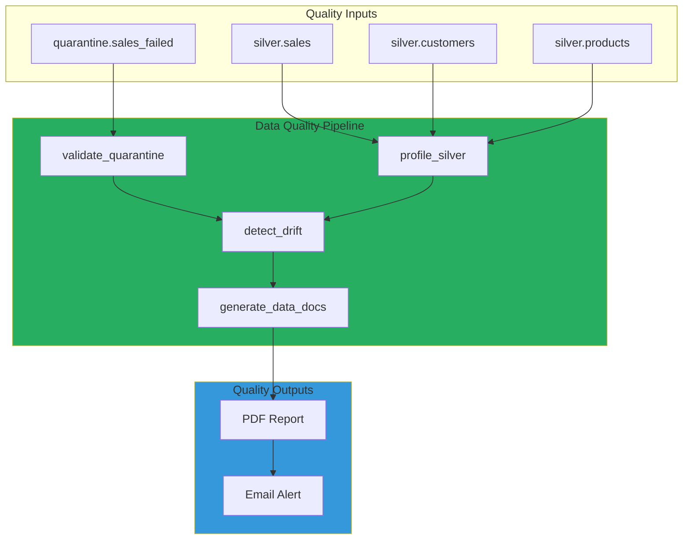
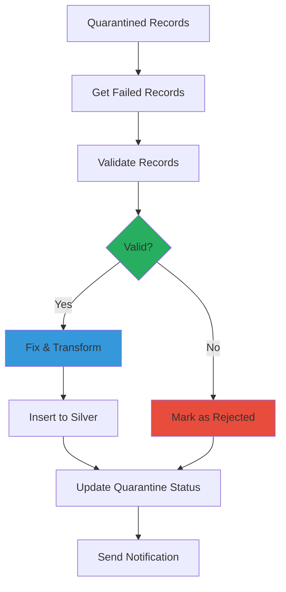
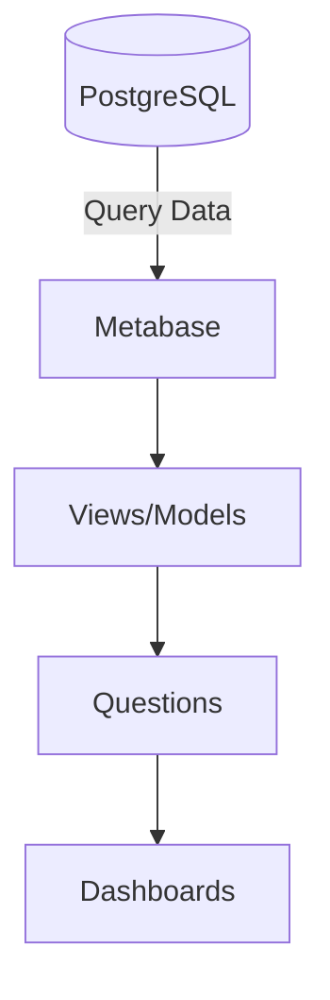

# Mini Data Platform Architecture

## Data Flow Architecture



---

## Updated Data Flow Sequence Diagram



---

## DAG Pipeline Flow



### DAG Details

| DAG | Tasks | Description |
|-----|-------|-------------|
| `generate_sample_data` | 1 | Generates test data to MinIO |
| `ingest_bronze_to_silver` | 3 | Bronze→Silver + dimension population |
| `data_quality_checks` | 5 | SQL validation, profiling, PDF reports |
| `silver_to_gold` | 7 | Star Schema aggregation (waits for data_quality_checks) |
| `remediation_workflow` | 4 | Auto-fix quarantined records |

### DAG Dependencies

```
generate_sample_data
        ↓
ingest_bronze_to_silver
        ↓
data_quality_checks (send_alerts)
        ↓
silver_to_gold (ExternalTaskSensor waits for data_quality_checks)
        ↓
Metabase Dashboards

remediation_workflow (manual trigger)
        ↓
quarantine.sales_failed
```

---

## Services Architecture

```mermaid
%%{init: {'theme': 'base'}}}
flowchart LR

    subgraph Services["DOCKER COMPOSE"]
        direction LR
        AF[Airflow<br/>+ DuckDB]
        DB[(PostgreSQL<br/>Silver, Gold, Quarantine, Metadata)]
        Redis[(Redis)]
        MinIO[MinIO<br/>Bronze Layer]
        MB[Metabase]
    end

    AF --> DB
    AF --> Redis
    AF <--> MinIO
    MB --> DB
```

---

## Data Quality Architecture



---

## Remediation Workflow



---

## Testing & Validation

```mermaid
%%{init: {'theme': 'base'}}}
flowchart LR

    subgraph Testing["TESTING & VALIDATION"]
        direction TB
        Unit[Unit Tests<br/>pytest]
        Integration[Integration Tests<br/>Docker]
        E2E[E2E Tests<br/>Full Pipeline]
        Security[Security Scan<br/>safety, bandit]
    end

    subgraph Data["DATA PIPELINE"]
        direction LR
        Bronze
        Silver
        Gold
    end

    Unit -->|Test Code| Data
    Integration -->|Test Connect| Data
    E2E -->|Validate Flow| Data
    Security -->|Scan Code| Dev
```

---

## CI/CD Pipeline

```mermaid
%%{init: {'theme': 'base'}}}
flowchart LR

    subgraph CI["CI - ON PUSH/PR"]
        direction TB
        Lint[Lint & Format<br/>flake8, black, mypy]
        Unit[Unit Tests<br/>pytest]
        Build[Build Docker<br/>GHCR]
    end

    subgraph CD["CD - DEPLOY"]
        direction TB
        Integration[Integration Tests<br/>PostgreSQL, MinIO]
        E2E[E2E Tests<br/>Full Stack]
        Notify[GitHub Summary]
    end

    Push[Push/PR] --> CI
    CI --> Lint
    CI --> Unit
    CI --> Build
    Build --> CD
    CD --> Integration
    CD --> E2E
    E2E --> Notify

    style CI fill:#3498DB
    style CD fill:#27AE60
    style Push fill:#E74C3C
```

---

## Complete System Overview

```mermaid
%%{init: {'theme': 'base'}}}
flowchart TB

    subgraph Dev["DEVELOPMENT"]
        direction TB
        DG[Data Generator]
        Tests[Tests & Validation]
        CI[GitHub Actions]
    end

    subgraph Runtime["RUNTIME ENVIRONMENT"]
        direction LR
        Lake[MinIO Bronze]
        AF[Airflow + DuckDB]
        Quality[Data Quality<br/>SQL-based]
        DB[PostgreSQL<br/>Silver, Gold, Quarantine]
        MB[Metabase]
    end

    DG -->|1. Generate| Lake
    Lake -->|2. Process| AF
    AF -->|3. Validate| Quality
    Quality -->|4. Report| Email
    AF -->|5. Store| DB
    DB -->|6. Visualize| MB
    
    Tests -->|Validate| DG
    CI -->|Deploy| Runtime
```

---

## Schema Summary

### Bronze Layer (MinIO)
- **Bucket**: `bronze`
- **Format**: Parquet files
- **Structure**: Partitioned by `ingest_date`

### Silver Layer (PostgreSQL)
- **Schema**: `silver`
- **Tables**: 
  - `sales` - Transaction fact table (populated from Bronze)
  - `customers` - Customer dimension (populated from sales data)
  - `products` - Product dimension (populated from sales data)

### Quarantine Layer (PostgreSQL)
- **Schema**: `quarantine`
- **Tables**:
  - `sales_failed` - Failed records awaiting remediation
    - id, payload (JSONB), error_reason, failed_at, ingestion_run_id
    - source_file, corrected_by, corrected_at, replayed, replayed_at

### Gold Layer (PostgreSQL)
- **Schema**: `gold`
- **Tables**: Aggregated analytics
  - `daily_sales` - Daily revenue metrics
  - `product_performance` - Product-level analytics
  - `customer_analytics` - Customer behavior + tier (Bronze/Silver/Gold/Platinum)
  - `store_performance` - Store-level metrics
  - `category_insights` - Category aggregates

### Metadata Layer (PostgreSQL)
- **Schema**: `metadata`
- **Tables**:
  - `ingestion_metadata` - Track processed files
  - `audit.ingestion_runs` - Audit trail

---

## Metabase Visualization Layer

### Dashboard Architecture



### Pre-configured Dashboards

| Dashboard | ID | Metrics | Charts |
|-----------|-----|---------|--------|
| Main Dashboard | 8 | KPIs + All metrics | Multiple |
| Executive Summary | 3 | Revenue, Transactions, Customers | Line, Scalar |
| Sales Overview | 2 | Daily sales trends | Line, Bar, Pie |
| Product Analytics | 4 | Product revenue, categories | Bar, Pie |
| Customer Analytics | 5 | Segments, LTV | Table, Pie |
| Store Performance | 6 | Revenue by location | Bar |
| Data Quality | 7 | Failed records, trends | Line, Bar, Table |

### Data Quality Dashboard

The Data Quality Dashboard provides real-time monitoring:

**KPIs:**
- Quarantine Records (total failed)
- Quality Score (88.67%)
- Total Records Processed
- Pending Remediation

**Visualizations:**
- Records by Error Type (bar chart)
- Failed Records Trend (line chart)
- Records by Source File (pie chart)
- Recent Failed Records (table)

### Database Connection Setup

1. Navigate to Metabase Admin > Databases
2. Add PostgreSQL database:
   ```
   Host: postgres
   Port: 5432
   Database: airflow
   Username: airflow
   Password: airflow
   ```

### SQL Queries Documentation

All dashboard queries are documented in `docs/dashboard_queries.sql`:
- 40+ queries organized by dashboard
- Section 1: Main Dashboard (11 queries)
- Section 2: Executive Summary (6 queries)
- Section 3: Sales Overview (5 queries)
- Section 4: Product Analytics (4 queries)
- Section 5: Customer Analytics (5 queries)
- Section 6: Store Performance (4 queries)
- Section 7: Data Quality (9 queries)
- Additional insights and schema reference

### Recommended Visualizations

- **Time Series**: Daily sales trends (line chart)
- **Categorical**: Revenue by product category (pie/bar)
- **Ranking**: Top 10 products/customers (table with ranking)
- **Geographic**: Sales by store location (map)

---

## Metabase Setup Guide

See `notes/METABASE_SETUP_GUIDE.md` for detailed instructions on:

### Creating Questions
1. Click "+ New" → Select "SQL query"
2. Select database "Mini Data Platform"
3. Write SQL query and click "Run"
4. Choose visualization type (Table, Line, Bar, Pie, Scalar)
5. Save to a collection

### Creating Collections
1. Click "+" in the sidebar → "New collection"
2. Name the collection (e.g., "Sales Analytics")
3. Organize questions and dashboards

### Creating Tabbed Dashboards
1. Click "+ New" → "Dashboard"
2. In edit mode, click "Add a tab"
3. Create tabs for each section
4. Drag questions into each tab

### Adding Filters
1. In dashboard edit mode, click "Add a filter"
2. Choose filter type (Date, Category, etc.)
3. Connect filters to visualizations

### Quick Access

| Dashboard | URL |
|-----------|-----|
| Main Dashboard | http://localhost:3000/dashboard/8-main-dashboard |
| Data Quality | http://localhost:3000/dashboard/7-data-quality |
