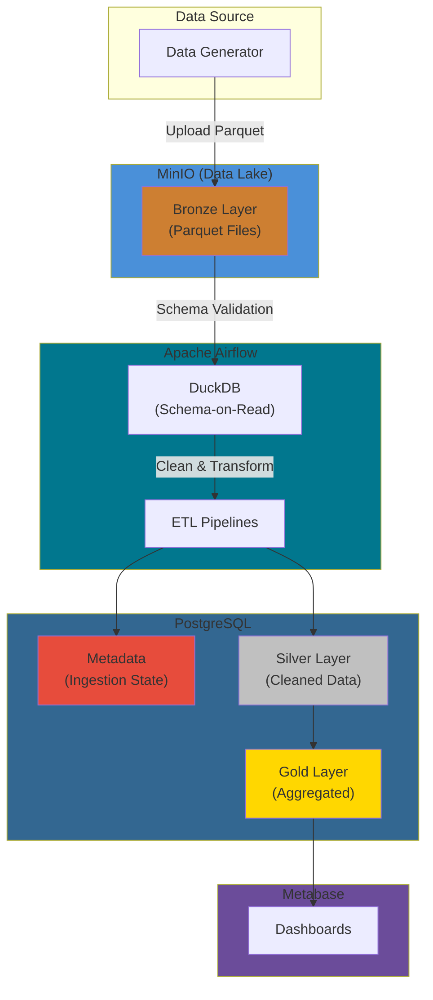
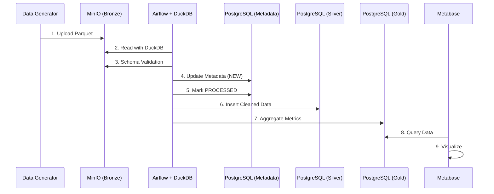
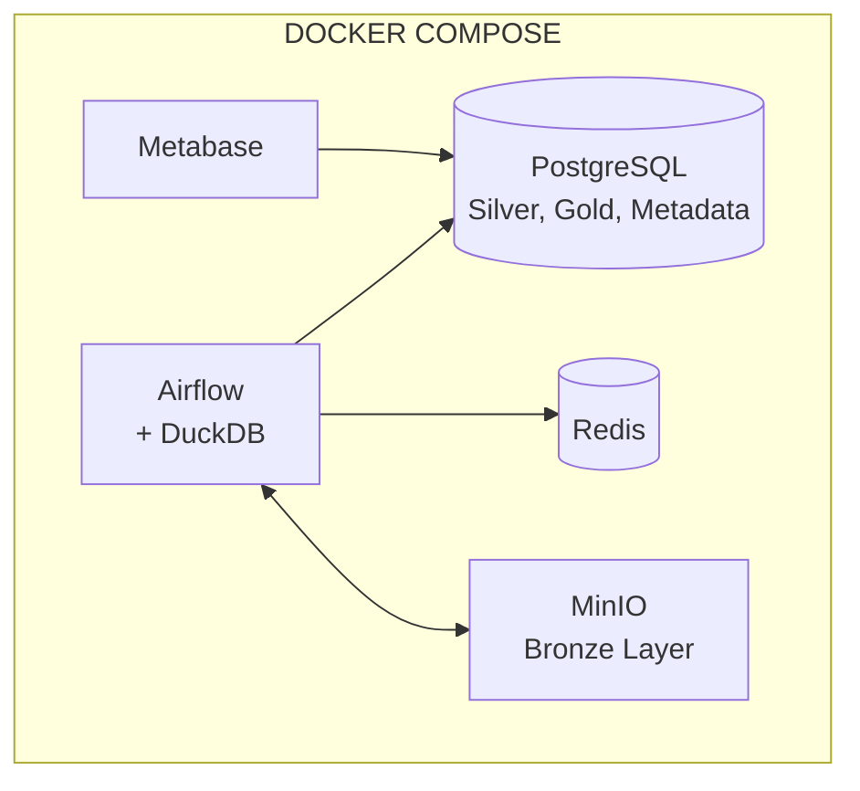
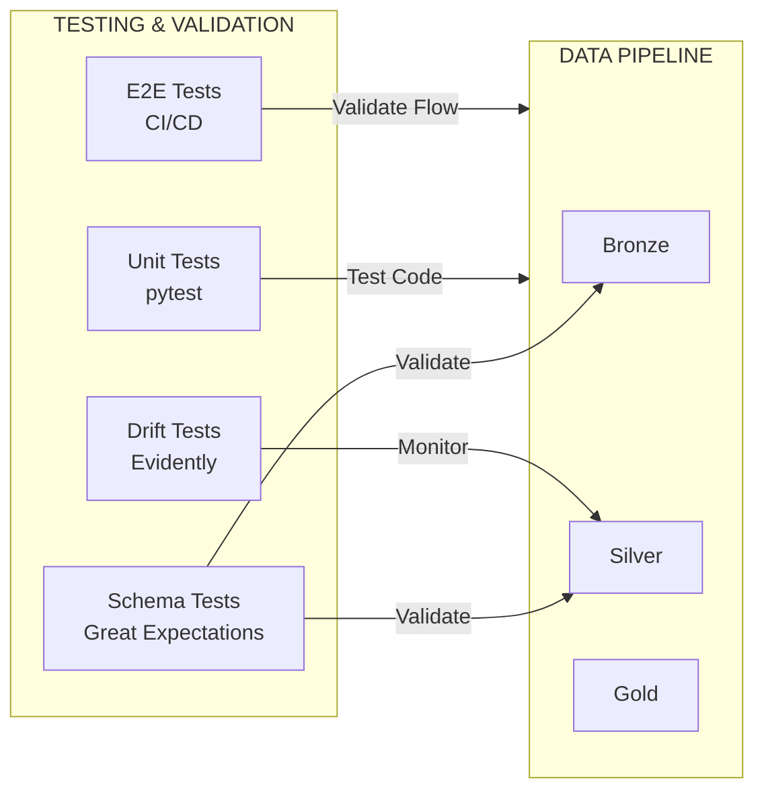
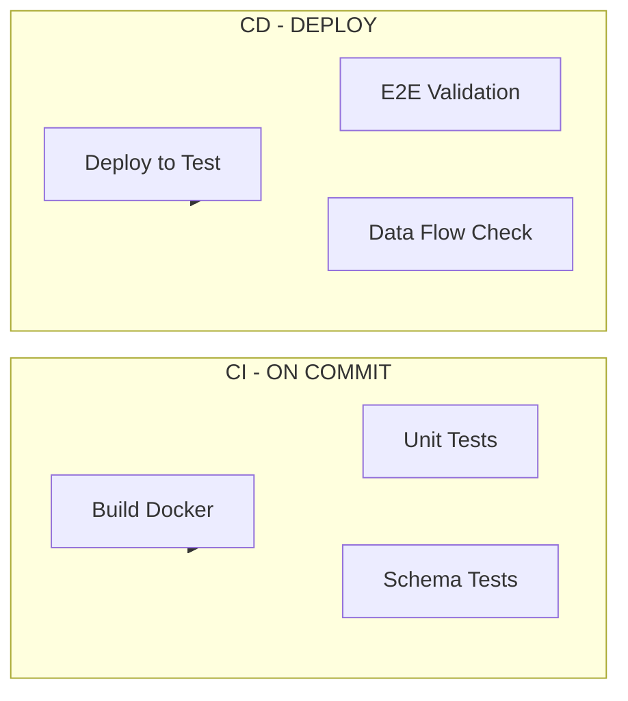
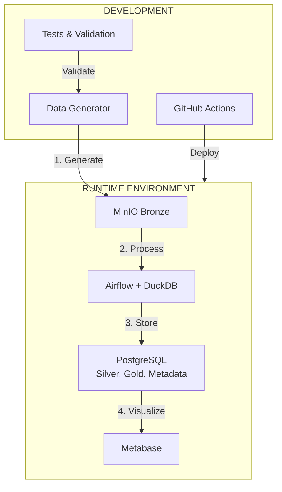

# Mini Data Platform Architecture

## Data Flow Architecture

---

## Data Flow Sequence Diagram

---

## Services Architecture

---

## Testing & Validation

---

## CI/CD Pipeline

---

## Complete System Overview

