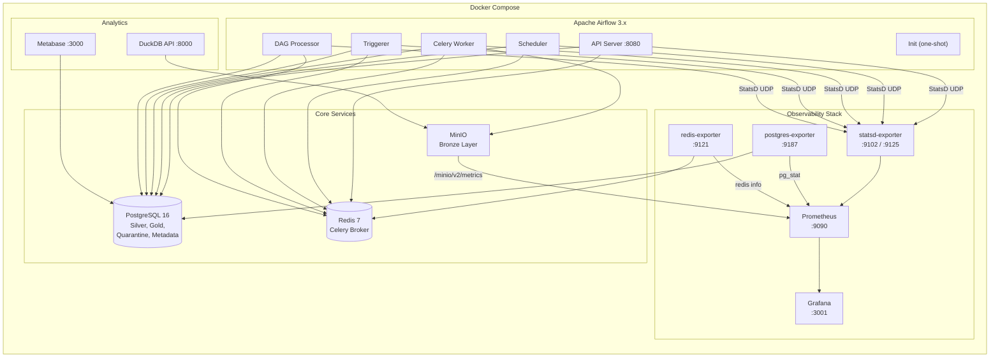
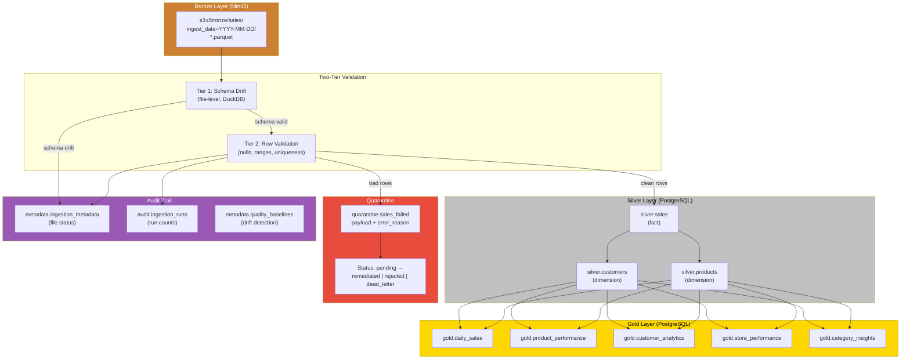
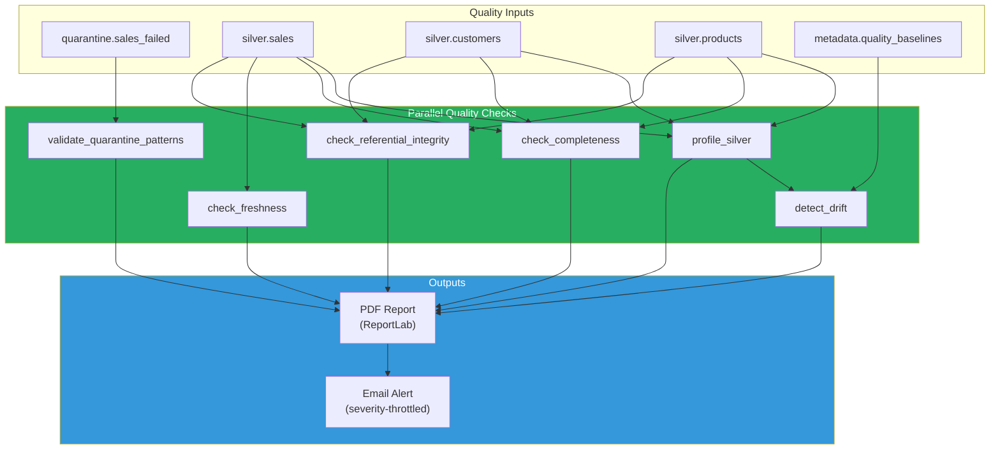
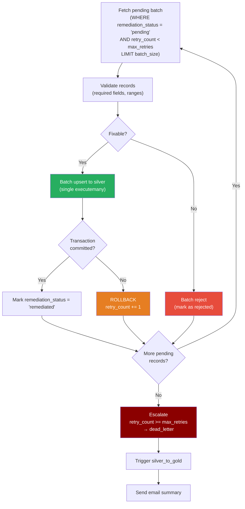
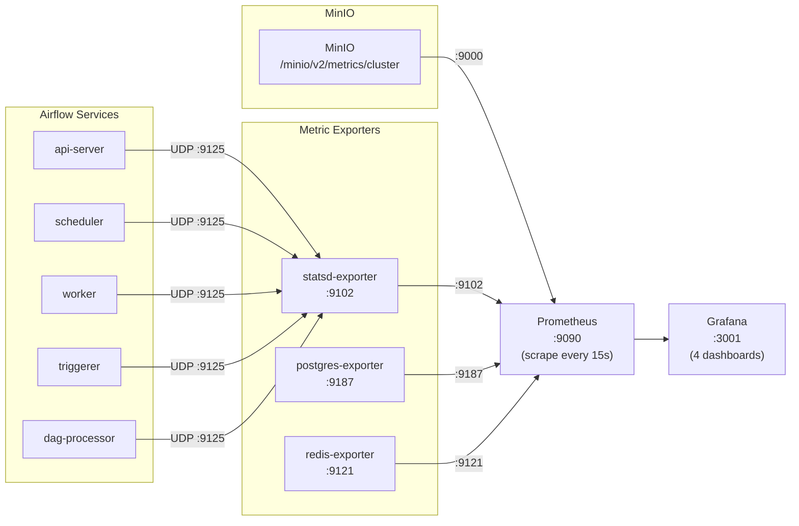
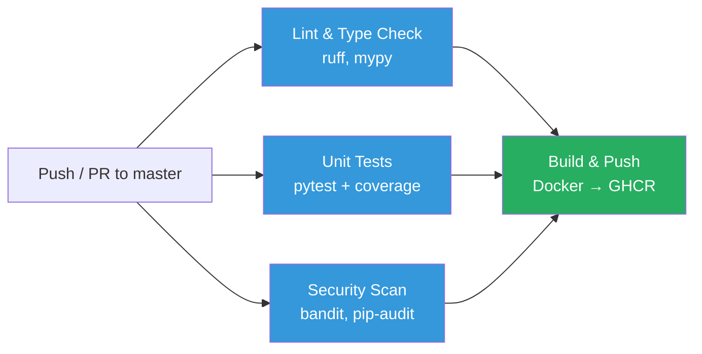

# Architecture Reference

This document provides detailed architectural diagrams for the Mini Data Platform. For the overview, see the [README](../../README.md).

---

## Services Architecture

---

## Data Flow Architecture

---

## Data Quality Pipeline

### Alert Severity Model

| Severity | Throttle | Trigger |
|----------|----------|---------|
| CRITICAL | None (always send) | Schema drift, data loss |
| WARNING | 1 hour | Drift > 10%, high quarantine rate, completeness < 95% |
| INFO | 6 hours | Successful runs, no issues |

---

## Remediation Pipeline

---

## Monitoring Architecture

### Grafana Dashboards

| Dashboard | Panels | Key Metrics |
|-----------|--------|-------------|
| Airflow Metrics | 8 | Scheduler heartbeat, DAG run duration, task finish rate, executor/pool slots |
| MinIO Metrics | 6 | Bucket size, object count, S3 traffic, request/error rates, disk capacity |
| PostgreSQL Metrics | 6 | Connections, DB size, tuple ops, transactions, cache hit ratio |
| Redis Metrics | 6 | Memory, clients, commands/s, connections, keys, hit ratio |

### StatsD Metric Mappings

| StatsD Pattern | Prometheus Metric | Labels |
|----------------|-------------------|--------|
| `airflow.dagrun.duration.*.*` | `airflow_dagrun_duration_seconds` | `dag_id`, `state` |
| `airflow.dag.*.*.duration` | `airflow_task_duration_seconds` | `dag_id`, `task_id` |
| `airflow.ti.finish.*.*.*` | `airflow_ti_finish_total` | `dag_id`, `task_id`, `state` |
| `airflow.scheduler.heartbeat` | `airflow_scheduler_heartbeat` | -- |
| `airflow.executor.*_slots` | `airflow_executor_slots` | `state` |
| `airflow.pool.*_slots.*` | `airflow_pool_slots` | `pool`, `state` |

---

## CI/CD Pipeline

### CI/CD Jobs

| Job | Tools | Description |
|-----|-------|-------------|
| Lint & Type Check | ruff check, ruff format, mypy | Linting, formatting, type checking |
| Unit Tests | pytest, pytest-cov | DAG imports, generator, remediation logic |
| Security Scan | bandit, pip-audit | Code vulnerability + dependency audit |
| Build & Push | Docker Buildx | Build image, push to GHCR (master only) |

### Schema Reference

| Schema.Table | Key Columns |
|---|---|
| `silver.sales` | sale_id (PK), transaction_id (UK), sale_date, customer_id, product_id, quantity, unit_price, net_amount, processed_at |
| `silver.customers` | customer_id (PK), customer_name, first_purchase_date, total_purchases, total_revenue, customer_segment |
| `silver.products` | product_id (PK), product_name, category, sub_category, avg_unit_price, total_quantity_sold |
| `quarantine.sales_failed` | id + ingestion_run_id (PK), payload (JSONB), error_reason, remediation_status, retry_count, replayed |
| `gold.daily_sales` | sale_date (PK), total_transactions, gross_revenue, net_revenue, unique_customers |
| `gold.product_performance` | product_id (PK), total_revenue, number_of_transactions |
| `gold.customer_analytics` | customer_id (PK), total_revenue, customer_tier, favorite_category |
| `gold.store_performance` | store_location (PK), total_revenue, total_customers_served |
| `gold.category_insights` | category (PK), total_revenue, total_products_sold |
| `metadata.ingestion_metadata` | file_path (PK), dataset_name, status, record_count, checksum |
| `audit.ingestion_runs` | ingestion_run_id (PK), rows_read, rows_written_silver, rows_quarantined, status |
